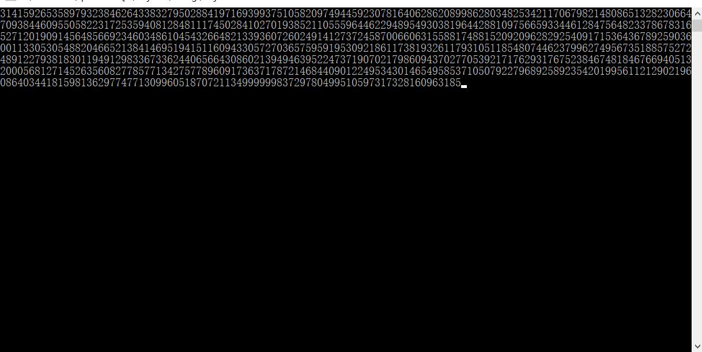

# Example scripts form Mycpp


---

## Overview

这些程序我是从一个叫'Myc++'的C++编译器软件中提供的例程找来的，权当备份用，如有侵权请告知。该编译器软件安装包目前已经不可找。


---

##  一个求π的诡异程序

这是我见过所有求π后N位程序中最诡异的，没有之一

### 具体代码
```C

#include<stdio.h>

long a=10000,b,c=2800,d,e,f[2801],g; 
main()
{
	for(;b-c;)f[b++]=a/5; 

	for(;d=0,g=c*2;c-=14,printf("%.4d",e+d/a),e=d%a) 

	for(b=c;d+=f[b]*a,f[b]=d%--g,d/=g--,--b;d*=b);
} 

/*(原程式第一行是int a=10000,b,c....因為在IBM PC 

上int只有2-byte,所以我改成long以便各platform都 
能run) 

(本程式連可算出pi值連小數點前共800位) 
(本程式節錄自sci.math FAQ,原作者未詳,我猜是外星人 :)*/  

```







##Contact me：

<bohrium.kwong@gmail.com>


